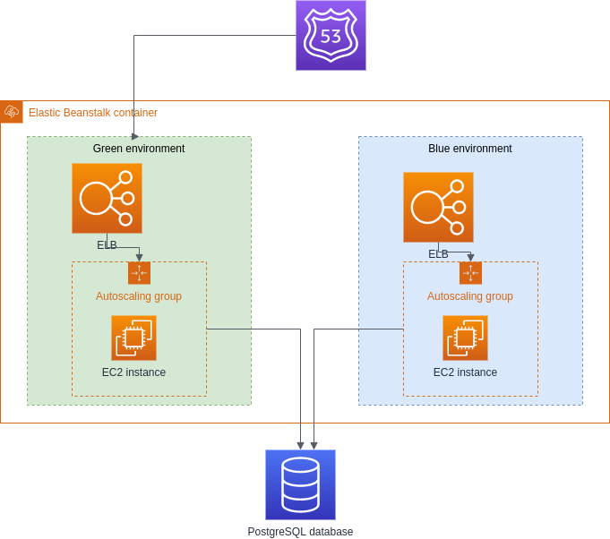

# README #

### Compiling and running the project locally

##### Prerequisites

* Maven
* Java 8
* PostgreSQL client (for ``psql`` command)
* PostgreSQL server
* curl

##### Setting up database

The database is created with the `psql` tool.
The table structure is configured using MVN with the LiquiBase plugin.

The following script executes both of these steps:

``setup_locally.sh``

Edit the script (or define the environment variables described below) and set the database endpoint if the PostgreSQL server is not running on the localhost. 

##### Configuring the database connection settings

The database connection settings are defined in the file ``src/main/resources/database.properties``.
You can edit this file directly, or you can set the following environment variables that will override the settings in the properties file:

* DATABASE_ENDPOINT
* DATABASE_NAME
* DATABASE_USERNAME
* DATABASE_PASSWORD

##### Compiling the project and running tests

Execute the following command:

``mvn verify``

##### Running the project and testing the API

Execute the following command to run the application locally:

``mvn spring-boot:run``

Then test if it works with ``curl``:

``curl -v --header "Content-Type: application/json" --request PUT --data '{"dateOfBirth":"2021-07-20"}' http://localhost:8080/hello/myuser``

``curl -v --header "Content-Type: application/json" --request GET http://localhost:8080/hello/myuser``

### Deploying on AWS

##### Prerequisites

* AWS CLI (https://aws.amazon.com/cli/)
* AWS Elastic Beanstalk CLI (https://docs.aws.amazon.com/elasticbeanstalk/latest/dg/eb-cli3.html)

##### Setting up the project on AWS

Run the script:

``./setup_aws.sh``

The script performs the following steps:

1. Creates Amazon RDS for PostgreSQL instance
1. Creates a "helloworld" database
1. Connects to the "helloworld" database and executes LiquiBase script to set up the tables
1. Initializes application on Elastic Beanstalk
1. Creates "green" environment
1. Clones the "green" environment as the "blue" environment

When the scrips finishes working, it shows the CNAME of the "green" environment. 
Copy it to the browser (or use ``curl``) to check if the application has been properly deployed, you should see message "Hello, world!". 

##### No-downtime deployment

The no-downtime deployment is done using the blue-green deployment approach (https://martinfowler.com/bliki/BlueGreenDeployment.html).
It's been done by leveraging the AWS Elastic Beanstalk solution.

The main environment on which the application is working is the "green" one.
The new application version is deployed to the "blue" environment.
Then we use Elastic Beanstalk CLI to swap the CNAMEs of the environments, so that the load balancer redirects requests to the newly deployed application version.

To perform this operation execute the following script:

``./deploy_aws.sh``

Note that after the script finishes you have to wait for about 60 seconds to let the DNS changes to get propagated and the HTTP caches to get expired.  

##### System diagram

The diagram below shows the main architectural components after deploying the application on AWS using Elastic Beanstalk:

 